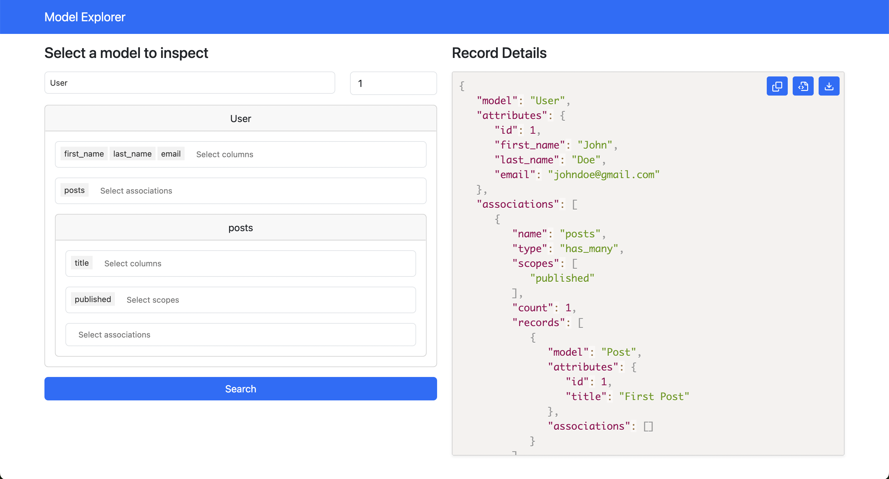

# ModelExplorer

[](https://github.com/victorauthiat/model_explorer/actions/workflows/build.yml)
[](https://codeclimate.com/github/VictorAuthiat/model_explorer/maintainability)
[](https://codeclimate.com/github/VictorAuthiat/model_explorer/test_coverage)

Rails gem to explore models attributes and their associations.



Most of the time, the production database is not accessible, which makes debugging difficult. This gem gives you read access to the database by searching for a record and its associations.
You can also copy the result of a search and import it to test behavior from another test db.

It is highly recommended to use the basic auth feature to protect access to the search form.

## Installation

Add this line to your application's Gemfile:

```ruby
gem "model_explorer"
```

And then execute:

```bash
$ bundle install
```

Run the following command to install the gem:

```bash
$ bin/rails model_explorer:install
```

This command will copy the initializer file to `config/initializers/model_explorer.rb`.

Add `--routes` to the command to add the engine routes to the `config/routes.rb` file or add the following line manually:

```ruby
mount ModelExplorer::Engine => "/model_explorer"
```

### Basic Auth

To protect access to the search form, you can use the basic auth feature.

Uncomment the following lines in the initializer file to enable the feature:

```ruby
ModelExplorer.configure do |config|
  config.basic_auth_enabled = true
  config.basic_auth_username = "admin"
  config.basic_auth_password = "password"
end
```

### Custom Access Control

You can also define a custom access control to restrict access to the search form.

Uncomment the following lines in the initializer file to enable verification:

```ruby
ModelExplorer.configure do |config|
  config.verify_access_proc = ->(controller) do
    controller.current_admin_user&.super_admin?
  end
end
```

The `verify_access_proc` is a lambda that receives the controller instance and returns a boolean value.

## Filter attributes

You can filter sensitive attributes as follows:

```ruby
ModelExplorer.configure do |config|
  config.filter_attributes_regexp = /api_key|api_secret/i
end
```

By default, the `filter_attributes_regexp` is set to `/password|secret/token/i`.


## Maximum Items per Association

Set the maximum number of options in association selects

```ruby
ModelExplorer.configure do |config|
  config.max_items_per_association = 5
end
```

To completely disable association dropdowns (i.e., the select will not be displayed in the search form), set the maximum items to 0.

## Maximum Scopes per Association

Control the number of scopes available in scope dropdowns by configuring the maximum allowed as follows:

```ruby
ModelExplorer.configure do |config|
  config.max_scopes_per_association = 5
end
```

Similar to item associations, scopes can also be completely disabled by setting the maximum to 0.

## Importing data

You can import data as follows:

1. Search for a record and its associations.
2. Copy the result of the search.
3. Go to your spec file and import the result as follows:

```ruby
let(:user) { ModelExplorer.import(File.read("spec/fixtures/test_user.json")) }
```

## Development

After checking out the repo, run `bin/setup` to install dependencies. Then, run `rake spec` to run the tests. For headless testing using Capybara and Selenium with Chrome, use: `CAPYBARA_DRIVER=selenium_chrome_headless rake spec`. You can also run `bin/console` for an interactive prompt that will allow you to experiment.

To install this gem onto your local machine, run `bundle exec rake install`. To release a new version, update the version number in `version.rb`, and then run `bundle exec rake release`, which will create a git tag for the version, push git commits and the created tag, and push the `.gem` file to [rubygems.org](https://rubygems.org).

## Contributing

Bug reports and pull requests are welcome on GitHub at https://github.com/[USERNAME]/model_explorer. This project is intended to be a safe, welcoming space for collaboration, and contributors are expected to adhere to the [code of conduct](https://github.com/[USERNAME]/model_explorer/blob/master/CODE_OF_CONDUCT.md).

## License

The gem is available as open source under the terms of the [MIT License](https://opensource.org/licenses/MIT).

## Code of Conduct

Everyone interacting in the ModelExplorer project's codebases, issue trackers, chat rooms and mailing lists is expected to follow the [code of conduct](https://github.com/[USERNAME]/model_explorer/blob/master/CODE_OF_CONDUCT.md).
